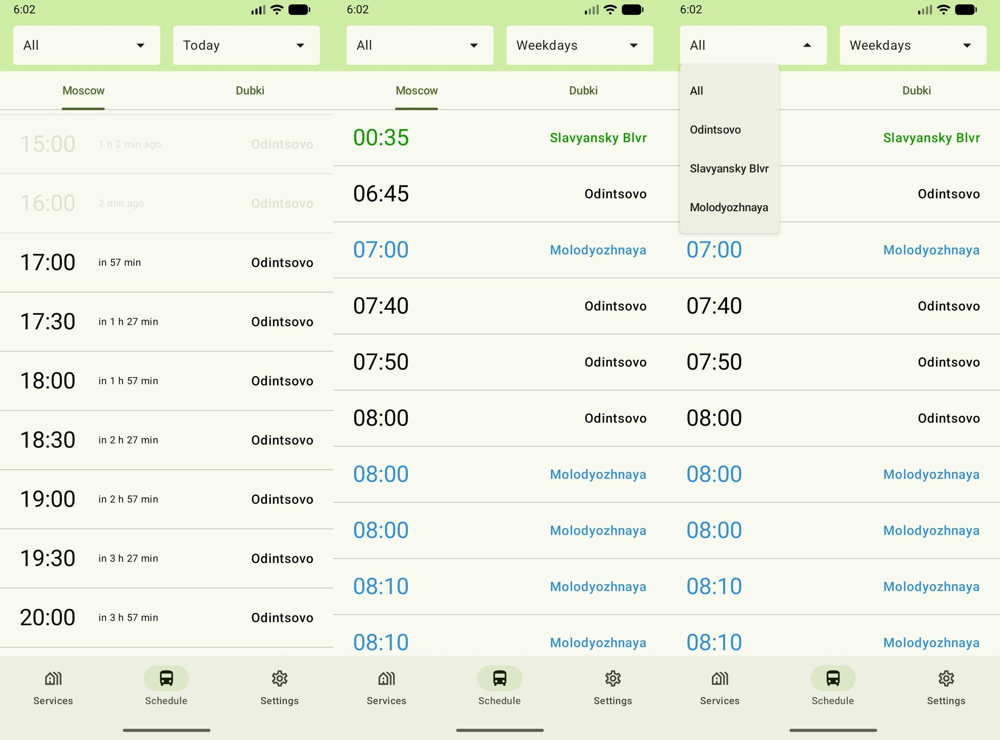

Multiplatform bus schedules and dormitory services for HSE students living in Dubki.

The app includes Moscow/Dubki bus directions, station and day filters, departure reminders on supported mobile
platforms, linen-room schedules for three buildings, cached data, and Russian, English and Kazakh interfaces.
Theme and language preferences are saved locally.



The images above are illustrative and may show an older UI. The current bus screen starts with the schedule list;
the next-bus summary card and the fresh-data timestamp were removed in
[PR #58](https://github.com/alad1nks/dubovozki-kmp/pull/58).

## Documentation

- [Behavior and data contracts](docs/behavior.md): current feature rules, platform differences and storage.
- [Testing](docs/e2e-testing.md): local commands, actual coverage, CI and remaining coverage gaps.
- [Contributor instructions](AGENTS.md): architecture boundaries, resources and required checks.

## Project layout

| Module | Responsibility |
|---|---|
| `composeApp` | Shared `App`, Koin composition root, navigation and iOS/JVM/JS entry points |
| `androidApp`, `iosApp` | Android activity and SwiftUI/Xcode shell |
| `feature:{busschedule,services,servicesschedule,settings}` | Screens, ViewModels, navigation and feature DI |
| `core:domain`, `core:data`, `core:model` | Use cases, repositories/cache/mapping and shared models |
| `core:firebase` | Firebase DTOs, SDK listeners and JVM REST adapter |
| `core:storage:{common,datastore,js}` | Storage API, DataStore and browser localStorage |
| `core:designsystem`, `core:navigation`, `resources` | Theme/components, destination contract and localized resources |

Targets are Android (minimum API 24), iOS ARM64 devices and ARM64 simulators, Desktop/JVM and Kotlin/JS browser.
There is no Wasm or Intel iOS simulator target. Shared sources live in each module's `src/commonMain`;
platform adapters live in `src/androidMain`, `src/iosMain`, `src/jvmMain` and `src/jsMain`.
See [settings.gradle.kts](settings.gradle.kts) for all modules.

## Prerequisites

- Use the checked-in Gradle wrapper. Versions are defined in [the version catalog](gradle/libs.versions.toml)
  and [wrapper configuration](gradle/wrapper/gradle-wrapper.properties).
- Set `JAVA_HOME` to an installed JDK (CI bootstraps with Temurin 17). Gradle provisions/uses JetBrains JDK 21
  according to [daemon criteria](gradle/gradle-daemon-jvm.properties); first setup needs network access.
- Android builds require the SDK, including the compile SDK from the catalog (currently 37), and either
  `ANDROID_HOME` or an untracked `local.properties` with `sdk.dir`.
- iOS builds require macOS, Xcode and CocoaPods for the Kotlin Firebase interop. The Swift shell also declares
  Firebase packages in the Xcode project. Open `iosApp/iosApp.xcodeproj` with scheme `iosApp`.
- Browser E2E uses Node.js 22 and the dependencies locked in `e2e/web/package-lock.json`.

### Firebase configuration

Obtain the real configuration for the relevant platform from the project owner/Firebase console:

| Platform | Untracked file / configuration |
|---|---|
| Android | `androidApp/google-services.json` |
| iOS | `iosApp/iosApp/GoogleService-Info.plist` |
| Web | `composeApp/src/jsMain/resources/firebaseConfig.js`, exporting a named `firebaseConfig` object |
| Desktop | Uses the public REST URL in `core/firebase`; no SDK config file |

Do not commit credentials or create placeholder SDK configs. Building a JS bundle does not prove that it can
start against Firebase: the browser also needs the configuration file at runtime. Playwright provides its own
in-memory demo config and Emulator connection; it does not require a production Web config.

## Build and run

Run from the repository root. On Windows, replace `./gradlew` with `.\gradlew.bat`.

| Platform | Command / launch |
|---|---|
| Android debug APK | `./gradlew :androidApp:assembleDebug`, then run `androidApp` from Android Studio |
| Desktop | `./gradlew :composeApp:run` |
| Desktop compilation | `./gradlew :composeApp:jvmJar` |
| Web development | `./gradlew :composeApp:jsBrowserDevelopmentRun` |
| Web production bundle | `./gradlew :composeApp:jsBrowserProductionWebpack` |
| iOS | Run scheme `iosApp` in Xcode on an ARM64 simulator/device |
| iOS simulator framework | `./gradlew :composeApp:linkDebugFrameworkIosSimulatorArm64` (macOS) |

The production Web bundle is written to `composeApp/build/kotlin-webpack/js/productionExecutable`.
The E2E static server also serves `composeApp/build/processedResources/js/main` for resources.
Keep `composeApp/webpack.config.d/watch.js`: it is a Kotlin/JS development workaround.

## Checks

```shell
./gradlew ktlintCheck
./gradlew :core:data:jvmTest :core:domain:jvmTest :feature:busschedule:jvmTest :composeApp:jvmTest
```

With Android SDK and Firebase configuration available, also run `./gradlew test :androidApp:assembleDebug`.
The [testing guide](docs/e2e-testing.md) lists screenshot verification, Chromium, instrumentation and iOS commands,
including the CI configuration-file exclusion used for host tests. No single test task covers every platform.
